<picture>
  <source media="(prefers-color-scheme: dark)" srcset="assets/dist/hero-dark.svg">
  <source media="(prefers-color-scheme: light)" srcset="assets/dist/hero-light.svg">
  
</picture>

<picture>
  <source media="(prefers-color-scheme: dark)" srcset="assets/dist/frame-dark.svg">
  <source media="(prefers-color-scheme: light)" srcset="assets/dist/frame-light.svg">
  
</picture>

[Immovable Tech](https://immovabletech.com)

<picture>
  <source media="(prefers-color-scheme: dark)" srcset="assets/dist/act-dark.svg">
  <source media="(prefers-color-scheme: light)" srcset="assets/dist/act-light.svg">
  
</picture>

<picture>
  <source media="(prefers-color-scheme: dark)" srcset="assets/dist/work-dark.svg">
  <source media="(prefers-color-scheme: light)" srcset="assets/dist/work-light.svg">
  
</picture>

<picture>
  <source media="(prefers-color-scheme: dark)" srcset="assets/dist/systems-dark.svg">
  <source media="(prefers-color-scheme: light)" srcset="assets/dist/systems-light.svg">
  
</picture>

CES 2019 public repo: [dummy sketch](https://github.com/iamrishab/artificial-intelligence-conductor)

How the later agent work is shaped

Questions become DAGs. Known SQL hits a template; the model only writes when nothing matches. Read-only, retries. Judges and a small red team sit in front of the user. When a form bot has to die, the new tools run beside it until they match.

<picture>
  <source media="(prefers-color-scheme: dark)" srcset="assets/dist/take-dark.svg">
  <source media="(prefers-color-scheme: light)" srcset="assets/dist/take-light.svg">
  
</picture>

[email me](mailto:rishabpal.work@gmail.com)

<picture>
  <source media="(prefers-color-scheme: dark)" srcset="assets/dist/stack-dark.svg">
  <source media="(prefers-color-scheme: light)" srcset="assets/dist/stack-light.svg">
  
</picture>

<picture>
  <source media="(prefers-color-scheme: dark)" srcset="assets/dist/chips-dark.svg">
  <source media="(prefers-color-scheme: light)" srcset="assets/dist/chips-light.svg">
  
</picture>

The rest of the bench

- Agents: LangGraph, LangSmith, LangChain, CrewAI, MCP, OpenAI Agents SDK
- Models: PyTorch, Transformers, LoRA / PEFT, Llama, Stable Diffusion / FLUX
- Retrieve: Neo4j, Milvus, Pinecone
- Serve: FastAPI, Docker, ONNX, TensorRT, NVIDIA Triton, MLflow
- Cloud: AWS (SageMaker, Lambda, Step Functions), GCP (Cloud Run, Vertex), Azure AI

<picture>
  <source media="(prefers-color-scheme: dark)" srcset="assets/dist/now-dark.svg">
  <source media="(prefers-color-scheme: light)" srcset="assets/dist/now-light.svg">
  
</picture>

<picture>
  <source media="(prefers-color-scheme: dark)" srcset="assets/dist/record-dark.svg">
  <source media="(prefers-color-scheme: light)" srcset="assets/dist/record-light.svg">
  
</picture>

[DB-tf](https://github.com/iamrishab/DB-tf) · [openvino-ocr](https://github.com/iamrishab/openvino-ocr) · [private-personal-proxy](https://github.com/iamrishab/private-personal-proxy) · [CES dummy sketch](https://github.com/iamrishab/artificial-intelligence-conductor) · [face-embedding thread](https://stackoverflow.com/questions/61302918/best-metric-for-face-embedding-comparison-during-inference)

<picture>
  <source media="(prefers-color-scheme: dark)" srcset="assets/dist/reach-dark.svg">
  <source media="(prefers-color-scheme: light)" srcset="assets/dist/reach-light.svg">
  
</picture>

rishabpal.work@gmail.com · [LinkedIn](https://linkedin.com/in/rishabpal) · [Immovable Tech](https://immovabletech.com)
