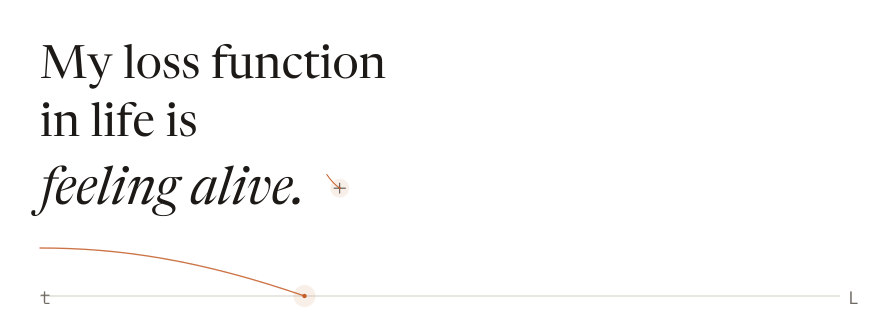
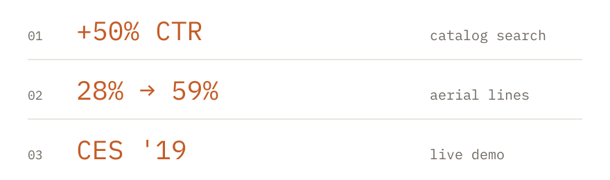
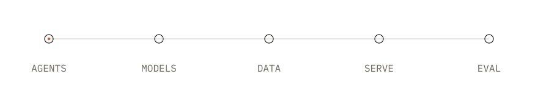

<picture>
  <source media="(prefers-color-scheme: dark)" srcset="assets/dist/hero-dark.svg">
  <source media="(prefers-color-scheme: light)" srcset="assets/dist/hero-light.svg">
  
</picture>

<picture>
  <source media="(prefers-color-scheme: dark)" srcset="assets/dist/frame-dark.svg">
  <source media="(prefers-color-scheme: light)" srcset="assets/dist/frame-light.svg">
  
</picture>

<a href="https://immovabletech.com">
<picture>
  <source media="(prefers-color-scheme: dark)" srcset="assets/dist/strip-site-dark.svg">
  <source media="(prefers-color-scheme: light)" srcset="assets/dist/strip-site-light.svg">
  
</picture>
</a>

<picture>
  <source media="(prefers-color-scheme: dark)" srcset="assets/dist/act-dark.svg">
  <source media="(prefers-color-scheme: light)" srcset="assets/dist/act-light.svg">
  
</picture>

<picture>
  <source media="(prefers-color-scheme: dark)" srcset="assets/dist/work-dark.svg">
  <source media="(prefers-color-scheme: light)" srcset="assets/dist/work-light.svg">
  
</picture>

<picture>
  <source media="(prefers-color-scheme: dark)" srcset="assets/dist/systems-dark.svg">
  <source media="(prefers-color-scheme: light)" srcset="assets/dist/systems-light.svg">
  
</picture>

<a href="https://immovabletech.com/portfolio/">
<picture>
  <source media="(prefers-color-scheme: dark)" srcset="assets/dist/strip-show-dark.svg">
  <source media="(prefers-color-scheme: light)" srcset="assets/dist/strip-show-light.svg">
  
</picture>
</a>

<picture>
  <source media="(prefers-color-scheme: dark)" srcset="assets/dist/take-dark.svg">
  <source media="(prefers-color-scheme: light)" srcset="assets/dist/take-light.svg">
  
</picture>

<picture>
  <source media="(prefers-color-scheme: dark)" srcset="assets/dist/stack-dark.svg">
  <source media="(prefers-color-scheme: light)" srcset="assets/dist/stack-light.svg">
  
</picture>

<picture>
  <source media="(prefers-color-scheme: dark)" srcset="assets/dist/chips-dark.svg">
  <source media="(prefers-color-scheme: light)" srcset="assets/dist/chips-light.svg">
  
</picture>

<picture>
  <source media="(prefers-color-scheme: dark)" srcset="assets/dist/now-dark.svg">
  <source media="(prefers-color-scheme: light)" srcset="assets/dist/now-light.svg">
  
</picture>

<a href="mailto:rishabpal.work@gmail.com">
<picture>
  <source media="(prefers-color-scheme: dark)" srcset="assets/dist/strip-email-dark.svg">
  <source media="(prefers-color-scheme: light)" srcset="assets/dist/strip-email-light.svg">
  
</picture>
</a>

<a href="https://linkedin.com/in/rishabpal">
<picture>
  <source media="(prefers-color-scheme: dark)" srcset="assets/dist/strip-link-dark.svg">
  <source media="(prefers-color-scheme: light)" srcset="assets/dist/strip-link-light.svg">
  
</picture>
</a>
