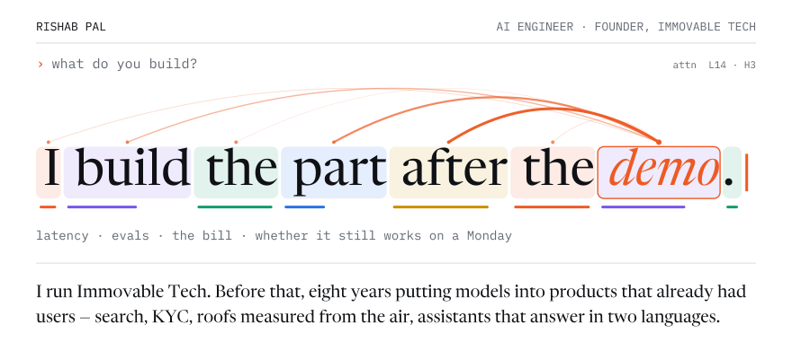
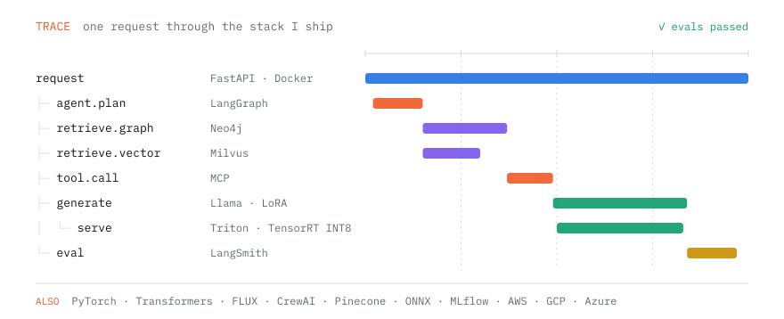
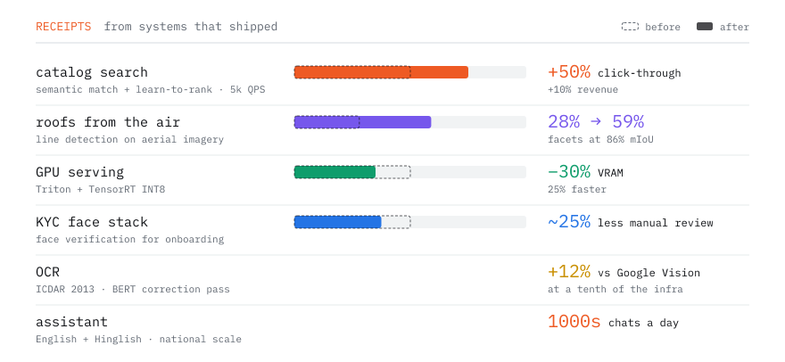

<picture>
  <source media="(prefers-color-scheme: dark)" srcset="assets/dist/hero-dark.svg">
  <source media="(prefers-color-scheme: light)" srcset="assets/dist/hero-light.svg">
  
</picture>

<picture>
  <source media="(prefers-color-scheme: dark)" srcset="assets/dist/trace-dark.svg">
  <source media="(prefers-color-scheme: light)" srcset="assets/dist/trace-light.svg">
  
</picture>

<picture>
  <source media="(prefers-color-scheme: dark)" srcset="assets/dist/receipts-dark.svg">
  <source media="(prefers-color-scheme: light)" srcset="assets/dist/receipts-light.svg">
  
</picture>

<picture>
  <source media="(prefers-color-scheme: dark)" srcset="assets/dist/now-dark.svg">
  <source media="(prefers-color-scheme: light)" srcset="assets/dist/now-light.svg">
  
</picture>

<a href="https://immovabletech.com"><picture><source media="(prefers-color-scheme: dark)" srcset="assets/dist/dock-site-dark.svg"><source media="(prefers-color-scheme: light)" srcset="assets/dist/dock-site-light.svg"></picture></a><a href="mailto:rishabpal.work@gmail.com"><picture><source media="(prefers-color-scheme: dark)" srcset="assets/dist/dock-mail-dark.svg"><source media="(prefers-color-scheme: light)" srcset="assets/dist/dock-mail-light.svg"></picture></a><a href="https://linkedin.com/in/rishabpal"><picture><source media="(prefers-color-scheme: dark)" srcset="assets/dist/dock-link-dark.svg"><source media="(prefers-color-scheme: light)" srcset="assets/dist/dock-link-light.svg"></picture></a>

